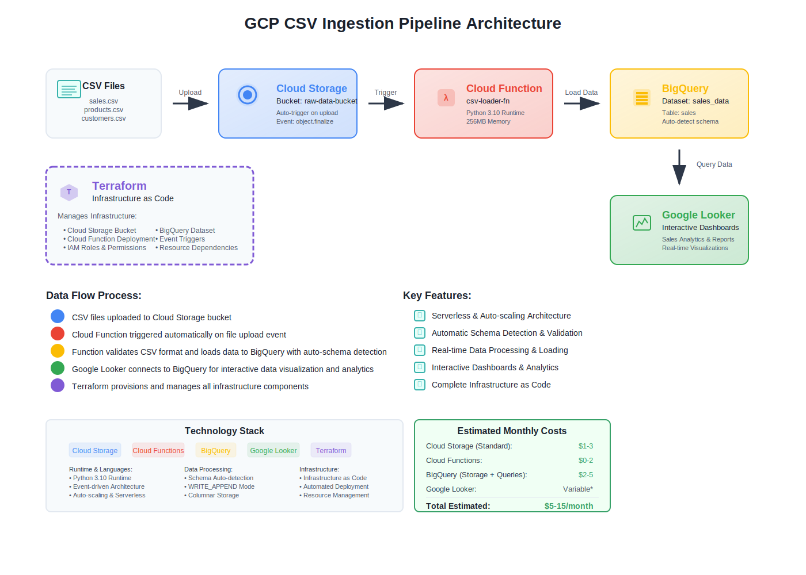
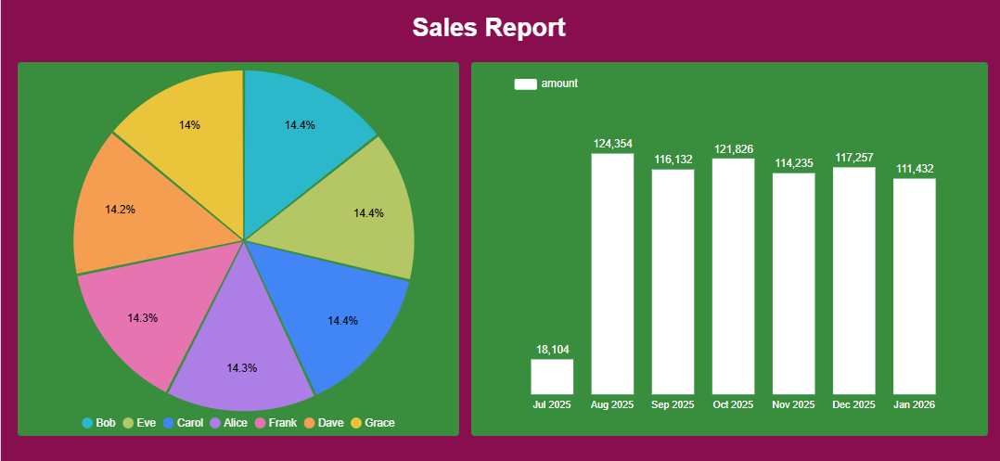

# GCP CSV Ingestion Project

An automated data ingestion pipeline that processes CSV files uploaded to Google Cloud Storage, loads them into BigQuery, and visualizes the data using Google Looker. The entire infrastructure is managed with Terraform for infrastructure as code.


*End-to-end data pipeline architecture*

## Architecture Overview

This project implements a serverless data pipeline with the following components:

- **Cloud Storage Bucket**: Receives CSV file uploads
- **Cloud Function**: Triggered automatically when files are uploaded, processes CSV files and loads them into BigQuery
- **BigQuery Dataset & Table**: Stores the ingested data for analysis
- **Google Looker**: Provides interactive dashboards and data visualization
- **Terraform**: Manages all infrastructure components

## Project Structure

```
gcp-ingestion-project/
├── cloud_function/
│   ├── main.py              # Cloud Function source code
│   └── requirements.txt     # Python dependencies
├── terraform/
│   ├── main.tf              # Main Terraform configuration
│   ├── variables.tf         # Variable definitions
│   ├── cloudfunction.tf     # Cloud Function resources
│   ├── outputs.tf           # Output values
│   └── terraform.tfvars.example  # Example configuration
├── test_sales.csv           # Sample CSV data
└── README.md               # This file
```

## Features

- **Automated CSV Processing**: Files uploaded to Cloud Storage are automatically processed
- **Schema Auto-detection**: BigQuery automatically detects CSV schema
- **Error Handling**: Non-CSV files are skipped with logging
- **Scalable**: Serverless architecture scales automatically
- **Data Visualization**: Interactive dashboards and reports with Google Looker
- **Infrastructure as Code**: Complete infrastructure managed with Terraform

## Prerequisites

Before deploying this project, ensure you have:

1. **Google Cloud Project** with the following APIs enabled:
   - Cloud Storage API
   - Cloud Functions API
   - BigQuery API
   - Cloud Resource Manager API

2. **Service Account** with the following roles:
   - Storage Admin
   - BigQuery Admin
   - Cloud Functions Admin
   - Project IAM Admin

3. **Local Tools**:
   - [Terraform](https://terraform.io/downloads) (>= 1.3.0)
   - [Google Cloud SDK](https://cloud.google.com/sdk/docs/install)

## Setup Instructions

### 1. Clone and Configure

```bash
git clone https://github.com/TelRich/gcp-ingestion-project.git
cd gcp-ingestion-project
```

### 2. Configure Terraform Variables

Copy the example variables file and customize it:

```bash
cp terraform/terraform.tfvars.example terraform/terraform.tfvars
```

Edit `terraform/terraform.tfvars`:

```hcl
project_id = "your-gcp-project-id"
bucket_name = "your-unique-bucket-name"
dataset_id = "sales_data"
gcp_credentials_file = "path/to/your/service-account-key.json"
```

### 3. Prepare Cloud Function

Create the Cloud Function deployment package:

```bash
cd cloud_function
zip -r ../cloud_function.zip main.py requirements.txt
cd ..
```

### 4. Deploy Infrastructure

Initialize and apply Terraform configuration:

```bash
cd terraform
terraform init
terraform plan
terraform apply
```

### 5. Test the Pipeline

Upload a CSV file to test the pipeline:

```bash
gsutil cp test_sales.csv gs://your-bucket-name/
```

## CSV File Format

The pipeline expects CSV files with the following characteristics:

- **Format**: Standard CSV with comma separators
- **Headers**: First row should contain column names
- **Example**:
  ```csv
  sale_id,sale_date,salesperson,amount
  1,2025-07-29,Alice,229
  2,2025-07-29,Bob,125
  ```

## How It Works

1. **File Upload**: CSV files are uploaded to the Cloud Storage bucket
2. **Trigger**: Cloud Function is automatically triggered by the `google.storage.object.finalize` event
3. **Processing**: Function validates the file is a CSV and loads it into BigQuery
4. **Storage**: Data is appended to the `sales` table in BigQuery with auto-detected schema
5. **Visualization**: Google Looker connects to BigQuery to create interactive dashboards and reports

## Data Visualization with Google Looker

Once data is loaded into BigQuery, you can create interactive dashboards and reports using Google Looker:


*Sample sales dashboard showing key metrics and trends*

### Setting up Looker

1. **Connect to BigQuery**: Create a new connection to your BigQuery dataset
2. **Create LookML Model**: Define your data model and relationships
3. **Build Dashboards**: Create visualizations for key metrics like:
   - Total sales by date
   - Sales performance by salesperson
   - Revenue trends and forecasts
   - Top-performing products/regions

### Sample Looker Queries

```sql
-- Daily sales summary
SELECT 
  sale_date,
  COUNT(*) as total_transactions,
  SUM(amount) as total_revenue,
  AVG(amount) as avg_transaction_value
FROM `your-project.sales_data.sales`
GROUP BY sale_date
ORDER BY sale_date DESC
```

## Monitoring and Logs

- **Cloud Function Logs**: View in Google Cloud Console > Cloud Functions > csv-loader-fn > Logs
- **BigQuery**: Check data in Console > BigQuery > your-dataset > sales table
- **Cloud Storage**: Monitor uploads in Console > Cloud Storage > your-bucket
- **Looker**: Monitor dashboard performance and user activity in Looker Admin

## Configuration Options

### Cloud Function Settings

- **Runtime**: Python 3.10
- **Memory**: 256MB
- **Trigger**: Cloud Storage object finalize
- **Environment Variables**:
  - `BQ_TABLE_ID`: Target BigQuery table

### BigQuery Job Configuration

- **Source Format**: CSV
- **Skip Leading Rows**: 1 (header row)
- **Auto-detect Schema**: Enabled
- **Write Disposition**: WRITE_APPEND

## Customization

### Modifying the Cloud Function

To customize data processing, edit `cloud_function/main.py`:

```python
# Example: Add data validation
def load_csv_to_bq(event, context):
    # Your custom logic here
    pass
```

### Adding New Infrastructure

Add resources to the Terraform files:

```hcl
# Example: Add a Cloud SQL database
resource "google_sql_database_instance" "main" {
    name = "sales-db"
    database_version = "POSTGRES_13"
    region = var.region
    # ... configuration
}
```

## Cost Optimization

- **Cloud Function**: Pay per invocation (first 2M invocations free monthly)
- **Cloud Storage**: Standard storage pricing
- **BigQuery**: Pay for storage and queries (first 1TB queries free monthly)
- **Total**: Typically under $10/month for moderate usage

## Security Considerations

- **IAM**: Function has minimal required permissions (BigQuery Data Editor)
- **Bucket Access**: Uniform bucket-level access enabled
- **Credentials**: Service account key should be kept secure
- **Data**: Consider encryption at rest for sensitive data

## Troubleshooting

### Common Issues

1. **Function Not Triggering**:
   - Check Cloud Storage bucket permissions
   - Verify trigger configuration

2. **BigQuery Load Errors**:
   - Check CSV format and encoding
   - Review BigQuery quotas and limits
   - Verify table schema compatibility

3. **Permission Errors**:
   - Ensure service account has required roles
   - Check IAM bindings in Terraform

### Debug Commands

```bash
# View function logs
gcloud functions logs read csv-loader-fn --limit 50

# Check BigQuery job status
bq ls -j --max_results 10

# List bucket contents
gsutil ls gs://your-bucket-name/
```

## Cleanup

To destroy all resources:

```bash
cd terraform
terraform destroy
```

**Warning**: This will permanently delete all data and resources.

## Contributing

1. Fork the repository
2. Create a feature branch
3. Make your changes
4. Test thoroughly
5. Submit a pull request

## License

This project is licensed under the MIT License - see the LICENSE file for details.

## Support

For issues and questions:
- Check the troubleshooting section above
- Review Google Cloud documentation
- Open an issue in this repository