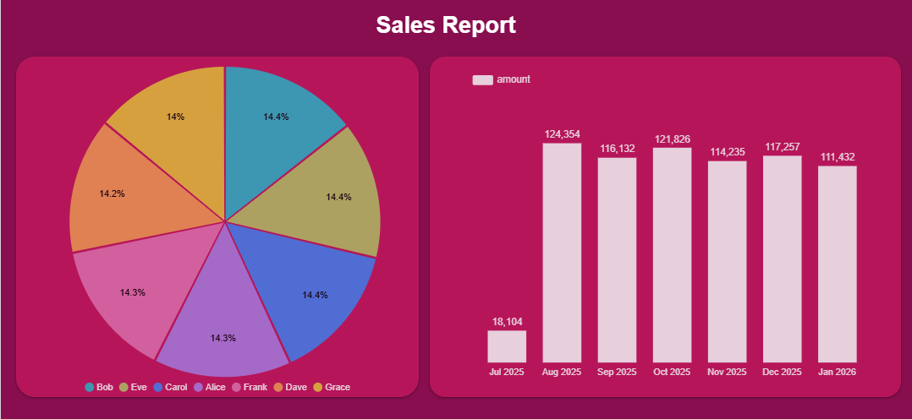

# GCP CSV Ingestion Project

Automated data pipeline that processes CSV files uploaded to Google Cloud Storage and loads them into BigQuery for analysis. Built with Cloud Functions and managed with Terraform.


## Architecture

* **Cloud Storage**: File upload triggers
* **Cloud Functions**: Processes CSV and loads to BigQuery
* **BigQuery**: Data warehouse for analytics
* **Google Looker**: Data visualization
* **Terraform**: Infrastructure management

## Project Structure

```
gcp-ingestion-project/
├── cloud_function/
│   ├── main.py              # Processing logic
│   └── requirements.txt     # Dependencies
├── terraform/
│   ├── main.tf              # Infrastructure
│   ├── variables.tf         # Configuration
│   ├── cloudfunction.tf     # Function deployment
│   └── outputs.tf           # Resource outputs
├── test_sales.csv           # Sample data
└── README.md
```

## Prerequisites

1. Google Cloud Project with APIs enabled:

   * Cloud Storage API
   * Cloud Functions API
   * BigQuery API

2. Service Account with roles:

   * Storage Admin
   * BigQuery Admin
   * Cloud Functions Admin

3. Tools:

   * [Terraform](https://terraform.io/downloads) (>= 1.3.0)
   * [Google Cloud SDK](https://cloud.google.com/sdk/docs/install)

## Quick Setup

1. **Configure variables**:

   ```bash
   cp terraform/terraform.tfvars.example terraform/terraform.tfvars
   # Edit terraform.tfvars with your project details
   ```

2. **Prepare Cloud Function**:

   ```bash
   cd cloud_function
   zip -r ../cloud_function.zip main.py requirements.txt
   cd ..
   ```

3. **Deploy infrastructure**:

   ```bash
   cd terraform
   terraform init
   terraform apply
   ```

4. **Test the pipeline**:

   ```bash
   gsutil cp test_sales.csv gs://your-bucket-name/
   ```

## Clone and Run Locally

To get started from a fresh environment, follow these steps after cloning the repository:

```bash
# 1. Clone the repo (replace URL with your own)
git clone https://github.com/TelRich/gcp-ingestion-project.git
cd gcp-ingestion-project

# 2. Copy and edit Terraform variables
cp terraform/terraform.tfvars.example terraform/terraform.tfvars
# Open terraform/terraform.tfvars and set project_id, bucket_name, dataset_id, etc.

# 3. Package the Cloud Function
cd cloud_function
zip -r ../cloud_function.zip main.py requirements.txt
cd ..

# 4. Deploy with Terraform
dd terraform
terraform init
terraform apply -auto-approve

# 5. Verify the pipeline
# Upload a sample file and watch it load into BigQuery
gsutil cp ../test_sales.csv gs://$(terraform output -raw bucket_url | sed 's|gs://||;s|/||')

# 6. Query data in BigQuery
bq query --use_legacy_sql=false 'SELECT * FROM `'"$PROJECT_ID"'.'"$dataset_id"'.sales` LIMIT 10;'
```

> Replace `<your-org>` and `<your-repo>` with your actual GitHub organization and repository name as needed.

## How It Works

1. CSV file uploaded to Cloud Storage bucket
2. Cloud Function automatically triggered
3. Function validates CSV and loads data to BigQuery
4. Data available for analysis in BigQuery and Looker



## Data Visualization with Looker

Create interactive dashboards with metrics like:

* Daily sales trends
* Performance by salesperson
* Revenue analysis
* Sales forecasting

## Configuration

Edit `terraform/terraform.tfvars`:

```hcl
project_id = "your-gcp-project-id"
bucket_name = "your-unique-bucket-name"
dataset_id = "sales_data"
gcp_credentials_file = "path/to/service-account.json"
```

## Sample Data

The included `test_sales.csv` contains:

* 1,295+ sales records
* Date range: July 2025 - January 2026
* 7 salespeople (Alice, Bob, Carol, Dave, Eve, Frank, Grace)
* Transaction amounts: \$100-999

## Monitoring

* **Function Logs**: Cloud Console > Cloud Functions > Logs
* **BigQuery Data**: Console > BigQuery > your-dataset > sales
* **Storage Activity**: Console > Cloud Storage > your-bucket

## Cost Estimate & Considerations

**Monthly Estimates (free-tier plus minimal usage):**

| Component        | Estimated Cost              | Notes                                |
| ---------------- | --------------------------- | ------------------------------------ |
| Cloud Storage    | \$0 (up to 5 GB)            | Always-free quota covers small CSVs  |
| Cloud Functions  | \$0 (up to 2 M invocations) | Free tier sufficient for development |
| BigQuery Storage | \$0 (up to 10 GB)           | Free tier covers dataset storage     |
| BigQuery Queries | \$0 (up to 1 TB/month)      | Includes model training via BQ ML    |
| Looker Studio    | Free                        | No license fee                       |
| **Total**        | **\$0–\$3**                 | Occasional egress or extra storage   |

> **Tip:** Enable **Budget Alerts** in the Billing console to notify you when spending approaches free-tier limits.

## Cleanup

To destroy all resources:

```bash
cd terraform
terraform destroy -auto-approve
```

## License

MIT License - see [LICENSE](LICENSE) file for details.
